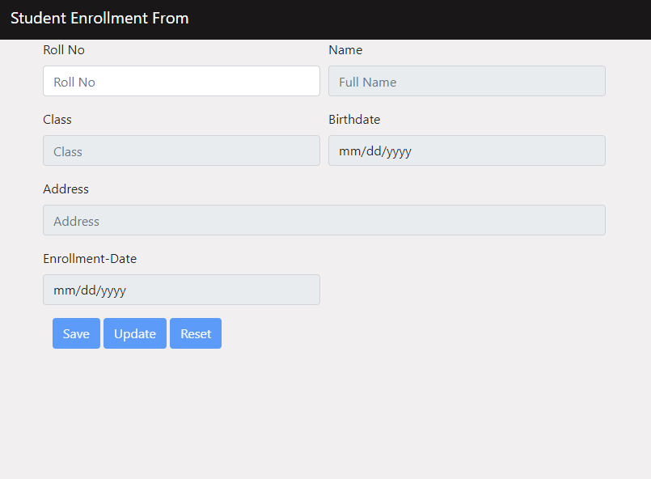
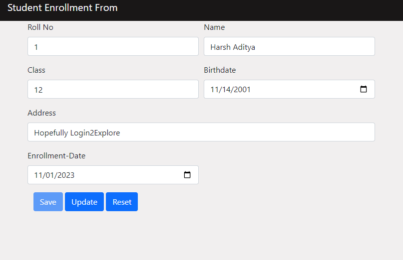
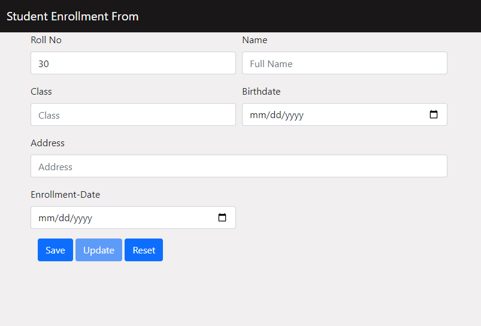

# Student Enrollment Form #
## Description
Student Enrollment Form using jsonPowerDB v2.0
The project consists of an HTML form with input fields for Roll-No, Full-Name, Class, Birth-Date, Address and Enrollment-Date. The form also has three control buttons: Save, Update and Reset. The form uses JavaScript and jQuery to validate the input data and perform CRUD operations using JPDB API. The project demonstrates how to use JsonPowerDB for storing and retrieving data in a JSON format.

## Benefits of using JsonPowerDB
* JsonPowerDB is a Real-time, High Performance, Lightweight and Simple to Use, Rest API-based Multi-mode DBMS.
* JsonPowerDB has ready-to-use API for JSON document DB, RDBMS, Key-value DB, GeoSpatial DB and Time Series DB functionality.
* JPDB supports and advocates for proper serverless and pluggable API development.
* JsonPowerDB is Schema-free, simple-to-use, Nimble and In-Memory database.
* It is built on top of one of the fastest and most real-time data indexing engines - PowerIndeX.
* It is a low-level (raw) form of data and is also human-readable.
* It helps developers in faster coding, reducing development costs.

## Illustration
* 
* 
* 
    
## Scope of functionalities
* Create a new student enrollment record in the database
* Update an existing student enrollment record in the database
* Reset the form to its initial state
* Validate the input data and show error messages if any
* Display the data in the form based on the Roll-No entered by the user

##Setup Instructions
* Clone or download the HTML file.
* Ensure JsonPowerDB is set up and configured for storing and managing the data entered via this form.
* Open the HTML file in a web browser to access the Student Enrollment Form.
* Usage
>Open the HTML file in a web browser.
>>Fill in the required student information.
>>>Use the buttons (Save, Update, Reset) based on the intended action (storing, modifying, or resetting data).  

## Sources
  * Introduction to JsonPowerDB - V2.0 course  on https://careers.login2explore.com/
  * [JsonPowerDB YouTube Channel](https://www.youtube.com/@jsonpowerdb9811)
  * [Bootstrap](https://getbootstrap.com/docs/5.0/getting-started/introduction/) 

## Examples of use
* To create a new student enrollment record, enter a unique Roll-No and fill in the other details in the form. Then click on the Save button to store the data in the database.
* To update an existing student enrollment record, enter a Roll-No and modify the other details in the form. Then click on the Update button to update the data in the database.
* To reset the form, click the Reset button to clear all the input fields and disable the other buttons.
 
## Release History
> v1.0 (November 2023)
>>Initial release featuring complete form functionality for student enrollment using JsonPowerDB.

## Project Dependencies
* __Bootstrap CSS__: Styling the form for a better user experience.
* __jQuery__: Enhances the form's functionality and interactions.
* __JsonPowerDB__: Used to interact with the JsonPowerDB database for storing and retrieving data.

##Other information
* The project was developed as a part of an internship program at Login2Xplore.
* The project uses Bootstrap for styling and layout.
* The project uses jQuery for AJAX calls and DOM manipulation.

 --------------------
